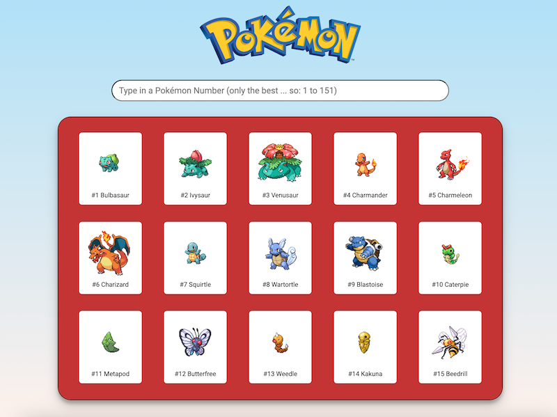

# WIP: My React Pokédex

I startet to create a react pokédex web application with the wonderfull pokéAPI (https://pokeapi.co/). This project should help me to apply and practice the React features and concepts on an example. Unfortunately, I haven't had the time to complete the app and add the features I wanted. But it will come ... Gotta catch'em all.

Remaining features / Open Tasks: 
- Searchbar with filter functionality
- Pokémon creator
- responsivness vor all devices
- finalized design

Source of pokemon banner: 
https://pngimg.com/image/27638

